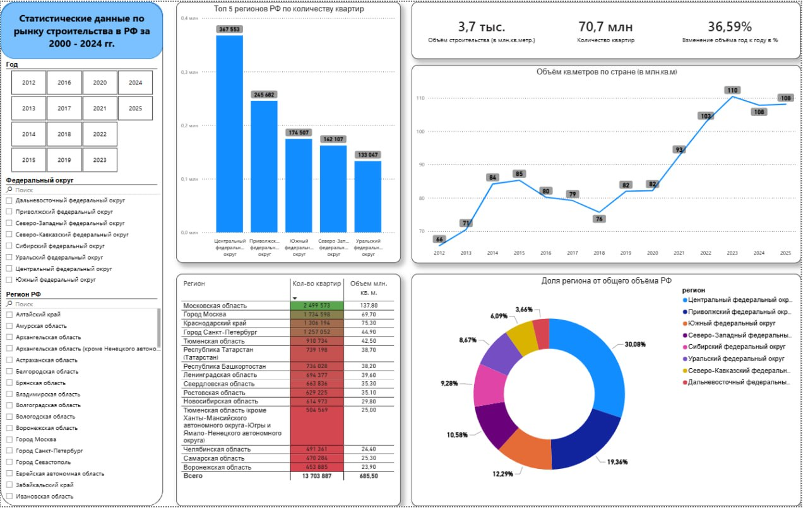

О проекте:
Анализ данных жилищного строительства по 85 регионам России за 2000–2024 гг. 

Источник: 
открытые данные Министерства строительства РФ.

Стек:
PostgreSQL 16 Хранение данных, аналитические запросы
SQL Оконные функции, CTE, self join, агрегации
Power BI Desktop Дашборд, DAX-меры, визуализации
DBeaverКлиент для работы с PostgreSQL

Ключевые выводы:
- 📈 Пик строительства достигнут в 2023 году — 110.4 млн кв.м (+7.5% к 2022)
- 📉 2024 год — первое падение за пять лет: −2.4% на фоне роста ключевой ставки ЦБ
- 🏙 ЦФО обеспечивает 28% всего объёма строительства РФ
- 🚀 Московская область — бессменный лидер среди регионов: 11.4 млн кв.м в 2024
- 📊 За 25 лет (2000–2024) в России построено свыше 21 млн квартир
- ⚠️ 15 регионов показали падение объёмов в 2024 по сравнению с 2023

