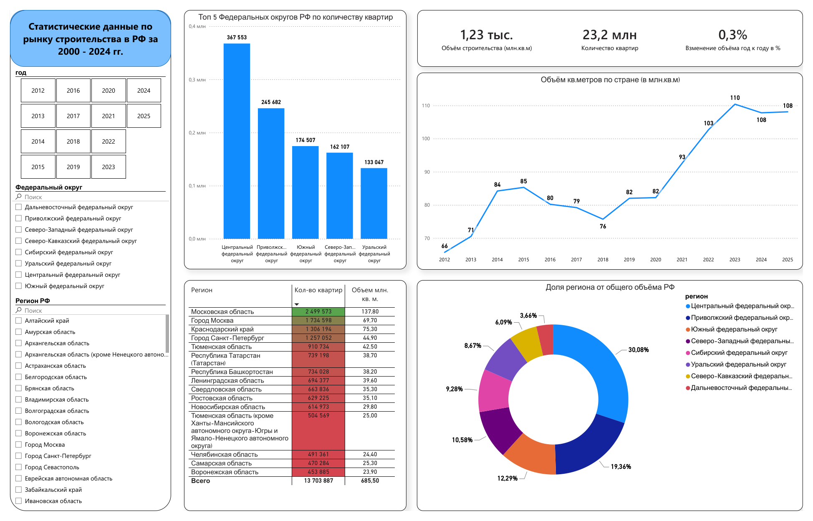
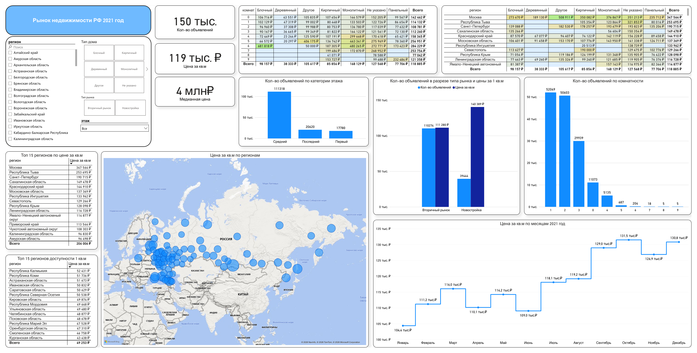
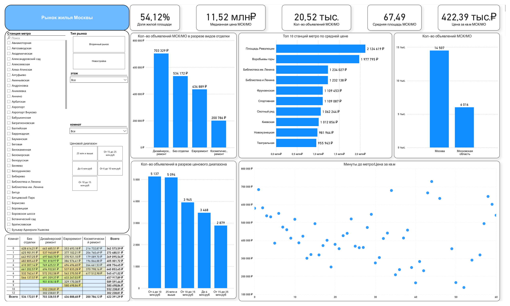

# 🏗 Рынок жилья РФ: от статистики строительства до объявлений о продаже

Комплексный аналитический проект от макростатистики жилищного строительства по всей стране до микроуровня — реальных объявлений о продаже квартир в Москве и регионах.

---

## 📊 Структура дашборда (3 страницы)

| Страница | Источник данных | Уровень анализа |
|---|---|---|
| 1. Статистика строительства РФ | Минстрой РФ, 2000–2024 | Макро: сколько и где строят |
| 2. Рынок недвижимости РФ 2021 | Kaggle, ~11 млн объявлений | Мезо: что и почём продают по всей стране |
| 3. Рынок жилья Москвы | Kaggle, ~20 тыс. объявлений | Микро: метро, отделка, цена за м² |

Идея проекта — показать полную картину: сначала государственная статистика объёмов строительства, затем реальные рыночные цены по регионам, и наконец детальный разбор крупнейшего рынка — Москвы.

---

## 📌 Ключевые выводы

Строительство (2000–2024):
- 📈 Пик строительства — 2023 год: 110.4 млн кв.м (+7.5% к 2022)
- 📉 2024 — первое падение за 5 лет: −2.4% на фоне роста ключевой ставки ЦБ
- 🏙 ЦФО обеспечивает 30% всего объёма строительства РФ
- 📊 За 25 лет в России построено свыше 23 млн квартир

Рынок объявлений РФ (2021):
- 💰 Разброс цены за м² между регионами — от 43 тыс. до 347 тыс. ₽ (Москва)
- 🏢 Новостройки в среднем дороже вторичного рынка на 26%
- 📍 Республика Тыва неожиданно на 2 месте по цене за м² — редкость предложения на рынке

Рынок Москвы (детально):
- 🚇 Станция «Площадь Революции» — самая дорогая по цене за м² (2.1 млн ₽)
- 🎨 Дизайнерский ремонт добавляет ~500 тыс. ₽ к цене за м² по сравнению с квартирой без отделки
- 🏠 Доля жилой площади от общей — 54% в среднем по рынку

---

## 🛠 Стек технологий

| Инструмент | Применение |
|---|---|
| PostgreSQL 16 | Хранение и агрегация данных |
| SQL | Оконные функции, CTE, self join |
| Power BI Desktop | 3-страничный дашборд, DAX-меры |

## 📂 Структура проекта

housing-construction-russia/
│
├── sql/
│   ├── 01-10_*.sql                    # SQL-задачи по статистике Минстроя
│   └── 00_realestate_create_tables.sql
│
├── data/
│   ├── apartments_clean.csv           # Квартиры по регионам, 2000–2024
│   ├── volume_clean.csv               # Объём строительства, 2012–2024
│   ├── russia_real_estate_clean.csv   # ~150 тыс. объявлений, вся РФ, 2021
│   └── moscow_real_estate_clean.csv   # ~20 тыс. объявлений, Москва/область
│
├── dashboard/
│   ├── page1_construction_stats.png
│   ├── page2_russia_real_estate.png
│   └── page3_moscow_market.png
│
└── README.md

---

## 🔍 Аналитические техники

SQL:  WHERE ,  GROUP BY ,  HAVING , self JOIN,  SUM() OVER ,  LAG() OVER ,  RANK() OVER , многоуровневые CTE

DAX:  CALCULATE ,  FILTER ,  ALL ,  RANKX ,  SWITCH(TRUE()) , вычисляемые таблицы ( SUMMARIZE ), пользовательская сортировка категорий

Обработка данных: декодирование категориальных переменных (тип дома, тип рынка, регион), сэмплирование больших датасетов с сохранением репрезентативности, очистка выбросов

---

## 📊 Дашборд Power BI

Страница 1 — Статистика строительства: топ федеральных округов, динамика по годам, доля региона от РФ, срезы по году и региону.

Страница 2 — Рынок РФ 2021: карта цены за м² по регионам, распределение по комнатности и типу дома, топ-15 дорогих и доступных регионов, динамика цены по месяцам.

Страница 3 — Рынок Москвы: влияние близости к метро на цену, топ-10 станций по средней цене, влияние отделки на стоимость, распределение цен по диапазонам.

---

## 📊 Скриншоты дашборда

**Страница 1 — Статистика строительства**

**Страница 2 — Рынок недвижимости РФ**

**Страница 3 — Рынок жилья Москвы**

