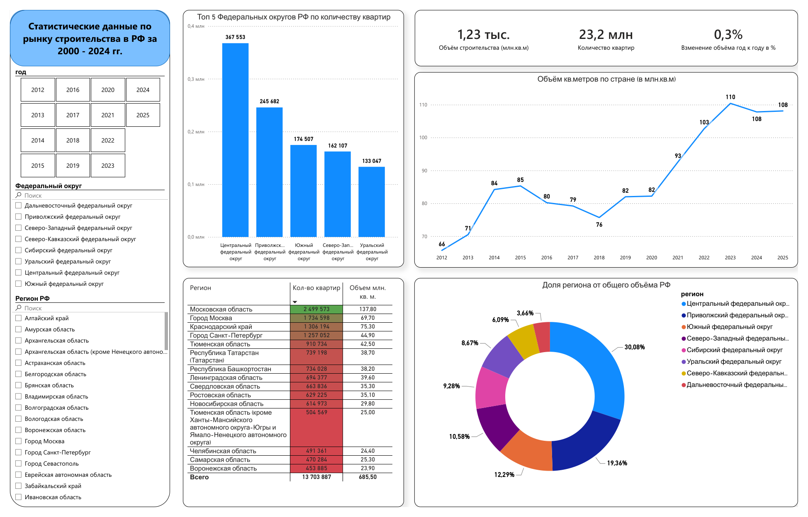
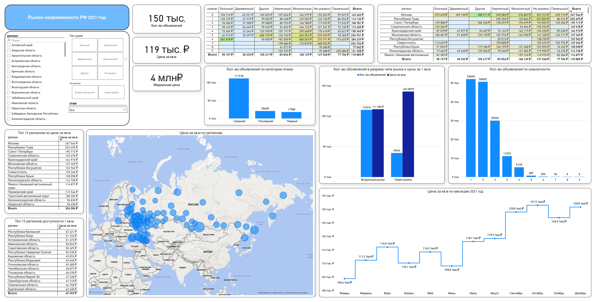
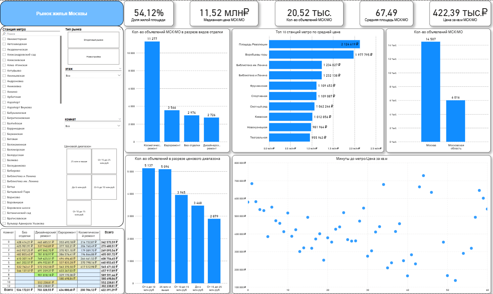

Комплексный аналитический проект из **трёх связанных дашбордов**: от макростатистики жилищного строительства по всей стране до микроуровня — реальных объявлений о продаже квартир в Москве и регионах.

---

## 📊 Структура дашборда (3 страницы)

| Страница | Источник данных | Уровень анализа |
|---|---|---|
| **1. Статистика строительства РФ** | Минстрой РФ, 2000–2024 | Макро: сколько и где строят |
| **2. Рынок недвижимости РФ 2021** | Kaggle, ~11 млн объявлений | Мезо: что и почём продают по всей стране |
| **3. Рынок жилья Москвы** | Kaggle, ~20 тыс. объявлений | Микро: метро, отделка, цена за м² |

Идея проекта — показать полную картину: сначала государственная статистика объёмов строительства, затем реальные рыночные цены по регионам, и наконец детальный разбор крупнейшего рынка — Москвы.

---

## 📌 Ключевые выводы

**Строительство (2000–2024):**
- 📈 Самый активный год — 2023. Построено 110,4 млн м² — на 7,5% больше, чем годом раньше. Это максимум за всю историю наблюдений.
- 📉 2024 — первый спад за пять лет. Объём строительства снизился на 2,4%, после пяти лет подряд непрерывного роста.
- 🏙 Центральный округ строит почти треть всей страны. В 2023 году на ЦФО пришлось 30% всего жилья, построенного в России (в 2024 году доля немного снизилась — до 28%).
- 🏠 За 26 лет в стране построено больше 23 миллионов квартир (с 2000 по 2025 год включительно)

**Рынок объявлений РФ (2021):**
- 💰 Цены сильно различаются по регионам — от 43 тысяч (Курганская область) до 347 тысяч рублей за м² (Москва)
- 🏢 Новостройки в среднем **дороже** вторичного рынка на 26%
- 📍 Неожиданный лидер — Республика Тыва, на 2-м месте по цене за метр. Причина — очень мало предложений на рынке (всего 59 объявлений), из-за чего единичные сделки сильно смещают среднюю цену

**Рынок Москвы (детально):**
- 🚇 Станция **«Площадь Революции»** — самая дорогая по цене за м² (2.1 млн ₽)
- 🎨 Дизайнерский ремонт связан с ценой на ~400 тыс. ₽/м² выше, чем косметический — даже при сравнении квартир сопоставимой площади (60–90 м²). Без поправки на площадь разница кажется больше (502 тыс. ₽), но часть этого разрыва объясняется тем, что квартиры с дизайнерским ремонтом в среднем почти вдвое крупнее (115 м² против 49 м², 2,9 комнаты против 1,7) — то есть часть эффекта даёт не ремонт сам по себе, а то, что это в целом более крупное и премиальное жильё
- 🏠 В среднем жилая площадь составляет чуть больше половины (54%) от общей площади квартиры

---

## 🛠 Стек технологий

| Инструмент | Применение |
|---|---|
| **PostgreSQL 16** | Хранение и агрегация данных |
| **SQL** | Оконные функции, CTE, self join |
| **Power BI Desktop** | 3-страничный дашборд, DAX-меры |
| **Python (pandas)** | Очистка и трансформация сырых данных (11 млн строк → выборка, декодирование категорий) |

---

## 📂 Структура проекта

```
housing-construction-russia/
│
├── sql/
│   ├── 01-10_*.sql                    # SQL-задачи по статистике Минстроя
│   └── 00_realestate_create_tables.sql
│
├── data/
│   ├── apartments_clean.csv           # Квартиры по регионам, 2000–2024
│   ├── volume_clean.csv               # Объём строительства, 2012–2024
│   ├── russia_real_estate_clean.csv   # ~150 тыс. объявлений, вся РФ, 2021
│   └── moscow_real_estate_clean.csv   # ~20 тыс. объявлений, Москва/область
│
├── dashboard/
│   ├── page1_construction_stats.png
│   ├── page2_russia_real_estate.png
│   └── page3_moscow_market.png
│
└── README.md
```

---

## 🔍 Аналитические техники

**SQL:** `WHERE`, `GROUP BY`, `HAVING`, self JOIN, `SUM() OVER`, `LAG() OVER`, `RANK() OVER`, многоуровневые CTE

**DAX:** `CALCULATE`, `FILTER`, `ALL`, `RANKX`, `SWITCH(TRUE())`, вычисляемые таблицы (`SUMMARIZE`), пользовательская сортировка категорий

**Обработка данных:** декодирование категориальных переменных (тип дома, тип рынка, регион), сэмплирование больших датасетов с сохранением репрезентативности, очистка выбросов

---

## 📊 Дашборд Power BI

**Страница 1 — Статистика строительства:** топ федеральных округов, динамика по годам, доля региона от РФ, срезы по году и региону.

**Страница 2 — Рынок РФ 2021:** карта цены за м² по регионам, распределение по комнатности и типу дома, топ-15 дорогих и доступных регионов, динамика цены по месяцам.

**Страница 3 — Рынок Москвы:** влияние близости к метро на цену, топ-10 станций по средней цене, влияние отделки на стоимость, распределение цен по диапазонам.

---


## 📊 Скриншоты дашборда

**Страница 1 — Статистика строительства**


**Страница 2 — Рынок недвижимости РФ**


**Страница 3 — Рынок жилья Москвы**

